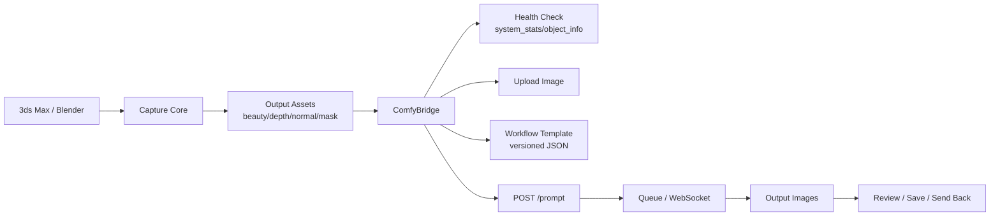

# AI Pipeline Plan

## 关键转向

截图不是最终目标。截图是从 DCC 场景进入 AI 出图管线的入口。

长期目标可以理解为：

```text
3ds Max / Blender 场景
  -> 多通道截图 / 渲染
  -> ComfyUI 工作流
  -> AI 出图 / 材质 / 多角度图
  -> 回到 DCC 或输出给客户
```

## 可靠性原则

以后我给出的方案必须先做自检：

- 本机有没有目标软件或目录。
- 目标服务是否启动。
- API 是否可访问。
- 工作流 JSON 是否能验证。
- 输入图片是否真的上传成功。
- 输出图片是否真的生成。
- 错误信息要落到日志，不靠猜。

不做：

- 不凭空假设 ComfyUI 节点存在。
- 不硬编码一堆 node id 后就不管。
- 不把 UI、截图、AI 请求塞在同一个脚本。
- 不让 3ds Max 插件直接承受所有 AI 复杂度。

## 已确认的信息

本机存在：

```text
C:\Users\Administrator\Documents\ComfyUI
```

本机 ComfyUI 有这些目录：

```text
input/
output/
models/
custom_nodes/
```

custom_nodes 里已经存在一些后续可能相关的节点方向：

```text
comfyui_controlnet_aux
ComfyUI_IPAdapter_plus
comfyui-depthanythingv2
ComfyUI-QwenVL
comfyui-qwenmultiangle
multiple-angle-camera-control
comfyui_ultimatesdupscale
comfyui-rmbg
```

注意：这只说明目录存在，不代表每个节点当前可用。后续必须通过 ComfyUI 的 `/object_info` 或实际 workflow 验证。

## 有资料支撑的 ComfyUI 接入点

ComfyUI 支持通过 HTTP/WebSocket 调用工作流：

- `POST /prompt`：提交 API workflow。
- `POST /upload/image`：上传输入图片。
- `GET /history/{prompt_id}`：读取输出结果。
- `GET /view`：读取输出图片。
- `GET /object_info`：查询节点信息。
- `GET /system_stats`：查看服务状态。
- `WS /ws`：实时监听队列和执行状态。

设计含义：

- 3ds Max 插件不应该直接生成 AI 图。
- 3ds Max 插件应该把截图和参数交给一个 `ComfyBridge`。
- `ComfyBridge` 负责上传图片、填 workflow、提交队列、取回结果。

## 推荐架构



## 不同阶段做什么

### Phase 1：截图 MVP

只做：

- 视口截图。
- 高清渲染。
- 路径和命名。
- 核心接口分离。

不接 ComfyUI。

### Phase 2：ComfyUI 健康检测

只做检测：

- ComfyUI 是否启动。
- API 地址是否可用。
- 当前有哪些节点。
- input/output 路径是否可写。
- 记录本机环境报告。

不自动出图。

### Phase 3：单图 img2img

流程：

```text
截图 -> upload/image -> workflow template -> prompt -> output
```

只支持一个固定 workflow，先跑通。

### Phase 4：控制图

从 DCC 输出更多控制输入：

- beauty screenshot
- depth
- normal
- mask / object id
- line / clay render
- camera metadata

交给 ComfyUI 做：

- ControlNet
- IPAdapter
- depth guidance
- style transfer
- upscaling

### Phase 5：多角度刷新出图

从 DCC 相机生成多角度：

```text
front / side / 3-4 view / top / detail
```

ComfyUI 做批量变体：

```text
same seed / seed range / style preset / material preset
```

## Workflow 模板管理

ComfyUI workflow 的节点 ID 容易变，不能裸写在代码里。

正确方式：

```text
workflows/
  img2img-basic/
    workflow_api.json
    mapping.json
    README.md
```

`mapping.json` 负责说明：

```json
{
  "input_image": "12.inputs.image",
  "positive_prompt": "6.inputs.text",
  "negative_prompt": "7.inputs.text",
  "seed": "3.inputs.seed"
}
```

这样 workflow 改了，只更新 mapping，不改插件核心。

## UI 未来形态

第一版不要把 AI 放进主 UI。

后面可以加一个 `AI` tab：

```text
Capture | Render | AI
```

AI tab 只放：

- ComfyUI status
- Workflow preset
- Prompt
- Strength / Seed / Steps
- Generate
- Output preview

复杂节点仍然留在 ComfyUI 里，不要在 3ds Max 里重做一个 ComfyUI。

## 结论

截图工具是入口，最终可以成为：

```text
DCC Scene-to-AI Image Control Pipeline
```

但实现顺序必须克制：

```text
先截图稳定
再检测 ComfyUI
再单图工作流
再多通道控制
再多角度批量
```

这样有数据、有自检、有扩展，不会胡编，也不会写成一团。
