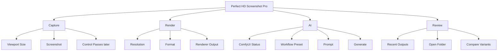

# Product UI System

## 产品定位

这个工具最终不是普通截图插件，而是：

```text
DCC Scene-to-AI Image Control Tool
```

它要服务的用户是：

- 3ds Max / Blender 用户
- 设计师、建模师、材质师
- 需要把场景截图、控制图、多角度图送进 AI 管线的人

所以 UI 不能像普通网页模板，也不能像只会炫技的 AI 面板。

## UI 选择依据

参考 UI/UX Pro Max 的判断规则，先按产品类型选风格：

```text
Product Type:
Creative Professional Tool
DCC Utility
Rendering Workflow Helper
AI Pipeline Control
```

适合风格：

- Minimal
- Pro App
- Dark Mode
- Technical Dashboard
- Compact Inspector

不适合风格：

- Glassmorphism
- Cyberpunk HUD
- Neumorphism
- Bento marketing layout
- Big SaaS dashboard cards

## 最终 UI 方向

命名：

```text
Precision Studio UI
```

关键词：

```text
compact
technical
calibrated
dark-first
high signal
low decoration
artist friendly
```

## 三层 UI 形态

### Level 1: Compact Plugin

第一版只做这个。

```text
┌ Perfect HD Screenshot Pro ─────────────┐
│ Capture | Render | AI                  │
├────────────────────────────────────────┤
│ Viewport  1920 x 1080        [Detect]  │
│ Preset    [Viewport] [2x] [4K] [8K]    │
│ Format    PNG      Alpha □  Gamma ☑    │
│ Folder    D:\shots\...          [...]  │
├────────────────────────────────────────┤
│ Ready                         [Save]   │
└────────────────────────────────────────┘
```

特点：

- 小窗口。
- 快速保存。
- UI 很薄。
- 不承载复杂 AI 功能。

### Level 2: Capture + AI Panel

等截图稳定后再做。

```text
┌ Perfect HD Screenshot Pro ─────────────────────┐
│ Capture | Render | AI | Review                 │
├────────────────────┬───────────────────────────┤
│ Preview            │ Settings                  │
│                    │ Workflow: img2img-basic   │
│ viewport thumb     │ Prompt                    │
│                    │ Strength / Seed / Steps   │
├────────────────────┴───────────────────────────┤
│ ComfyUI: Online     Queue: idle      [Generate]│
└────────────────────────────────────────────────┘
```

特点：

- 加 ComfyUI 状态。
- 加 prompt 和 workflow preset。
- 仍然不重做 ComfyUI 节点编辑器。

### Level 3: Canvas Workspace

最终高级形态。

```text
┌─────────────────────────────────────────────────────────┐
│ Modes / Cameras       Preview Canvas        Inspector   │
│                                                         │
│ Capture              ┌────────────────┐     Resolution  │
│ Render               │                │     Workflow    │
│ AI                   │  scene output  │     Prompt      │
│ Batch                │                │     Control     │
│                      └────────────────┘     Queue       │
│ Recent Outputs / Variants / Multi-angle Results          │
└─────────────────────────────────────────────────────────┘
```

特点：

- 适合多角度。
- 适合 AI 变体对比。
- 适合材质方案、风格方案、批量队列。
- 不适合第一版。

## 信息架构



## 第一版控件优先级

必须有：

- Mode: Capture / Render
- Detect Viewport
- Width / Height
- Preset: Viewport / 2x / 4K / 8K / Custom
- Format
- Folder
- Save
- Status

可以有：

- Alpha
- Gamma
- Show VFB

先不要有：

- Prompt
- Workflow list
- Output history
- Multi-angle
- Canvas preview

## UI 质量规则

根据 UI/UX Pro Max 的关键规则，适配到 DCC 插件：

- 每个界面只有一个主操作。
- 重要状态必须有文字，不只靠颜色。
- 保存、生成、批量渲染必须有 loading / disabled 状态。
- 错误要显示原因，不只写 Failed。
- 控件对齐比装饰更重要。
- 标签短，参数密度高但不挤。
- 交互尺寸要够点，尤其未来 Blender/触控屏也可能使用。
- 深色下文字对比必须足够。

## 颜色系统

```text
Base 0:   #121417
Base 1:   #191c20
Base 2:   #22262c
Base 3:   #2d333b
Border:   #3a414a
Text:     #e8eaee
Muted:    #9aa3ad
Accent:   #72a7ff
Success:  #62d28f
Warning:  #e7b85f
Danger:   #ff6b6b
```

## 未来 AI UI 的克制原则

AI 功能不要一开始塞进主窗口。

正确做法：

```text
截图稳定 -> ComfyUI 检测 -> AI tab -> 结果 review -> 画布工作台
```

AI tab 里也不要做节点编辑器。ComfyUI 已经是节点编辑器，我们只做：

- 选择 workflow
- 填关键参数
- 上传截图
- 提交生成
- 看结果

## 当前决策

第一版 UI 用：

```text
Level 1 Compact Plugin
Precision Studio UI
```

先不做画布。

但结构上预留：

```text
Capture | Render | AI | Review
```

第一版只启用 Capture / Render，AI 和 Review 先不做或置灰。
