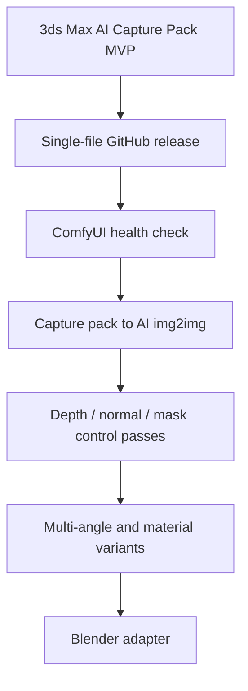

# DCC Capture Bridge

**MVP product name:** Perfect HD Screenshot Pro

A lightweight 3ds Max capture tool today, designed as a future DCC-to-AI image control bridge for 3ds Max, Blender, and ComfyUI workflows.

## Current MVP

The first usable build is a single 3ds Max MAXScript file:

```text
dist/PerfectHDScreenshotPro_MVP.ms
```

Usage:

1. Download the `.ms` file.
2. Drag it into a 3ds Max viewport.
3. Use **AI Capture Pack** first. This is the default MVP workflow.
4. Use **Viewport Snapshot** only when you want a loose image file.
5. Use **Production Render** only when you intentionally want to run the current 3ds Max renderer.

## AI Capture Pack Output

The default mode creates a small session folder:

```text
<output-folder>/<prefix>_session_YYYYMMDD_HHMMSS/
  capture/
    viewport.png
  ai/
  metadata.txt
```

`metadata.txt` records the tool version, DCC source, capture type, image path, width, height, timestamp, and a clear note that the viewport image is captured at the active viewport's real pixel size. No fake 4K/8K viewport upscale is claimed.

## MVP Features

- Drag-and-drop launch in 3ds Max.
- Default **AI Capture Pack** workflow for AI-readable reference capture.
- Detect active viewport resolution.
- Save the active viewport as an image at its real pixel size.
- Write a metadata sidecar for AI / pipeline use.
- Optional production render using the current 3ds Max Render Setup.
- Open Render Setup from the panel when render settings need to be changed.
- Thin UI, reusable core API.

## Important Product Logic

The primary value is **not** replacing 3ds Max rendering.

The primary value is:

```text
fast viewport capture
-> clean reference image + metadata
-> future AI input / control asset
```

`viewport.getViewportDib()` and `gw.getViewportDib()` capture the active viewport's real pixels. They do not generate arbitrary 4K/8K viewport screenshots. Therefore, the tool should not pretend that viewport snapshots can be fake-upscaled into true 8K viewport output.

Production Render mode is optional. It uses the current 3ds Max renderer and Render Setup. It is useful as a convenience bridge, but it is not the core product.

## Product Direction

This project starts with an AI-readable capture pack, but the long-term idea is broader:

```text
3ds Max / Blender scene
-> beauty / viewport / depth / normal / mask / camera metadata
-> ComfyUI workflow
-> AI image, material, and multi-angle variants
```

The project should become a **DCC capture bridge**, not a second ComfyUI node editor and not a one-off screenshot script.

## Roadmap



## Design Principles

- AI Capture Pack is the default mode.
- Viewport Snapshot is a utility mode.
- Render mode must clearly say it uses the current renderer.
- Do not put ComfyUI complexity into the DCC UI too early.
- Keep code/API naming English-first.
- Add localization only after a safe encoding strategy is tested.
- Treat screenshots as capture assets, not the final product.
- Version workflow templates instead of hard-coding ComfyUI node IDs.

## Language Strategy

English is the primary development language for code, API names, GitHub issues, and release notes.

Chinese UI and documentation are planned and important, but MAXScript encoding can be fragile across Windows and 3ds Max versions. We will add bilingual UI carefully after testing the safest localization approach.

中文说明：这个项目第一阶段不再只是“高清截图”，而是先做 3ds Max 的 AI Capture Pack：一键导出视口图和 metadata。后续计划扩展为 3ds Max / Blender 到 ComfyUI 的 AI 出图控制桥。代码和 GitHub 先以英文为主，中文界面会在确认编码方案后加入。

## Status

Early MVP. Not yet widely tested across 3ds Max versions.
