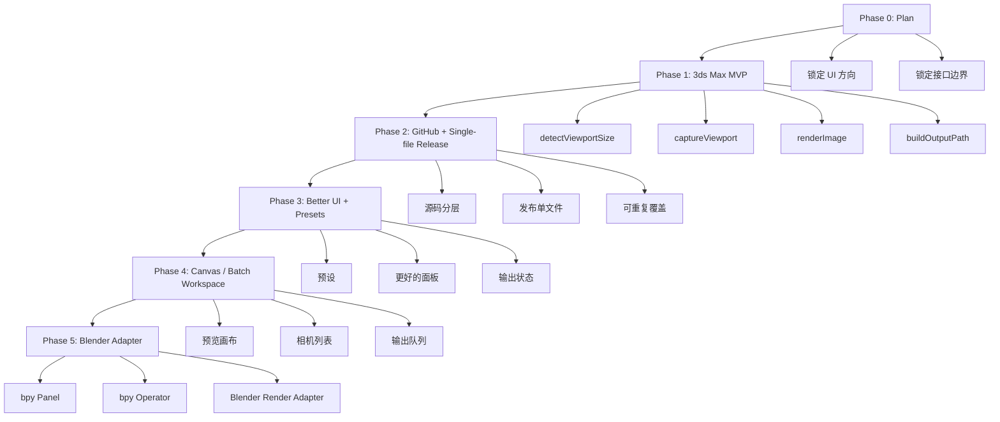
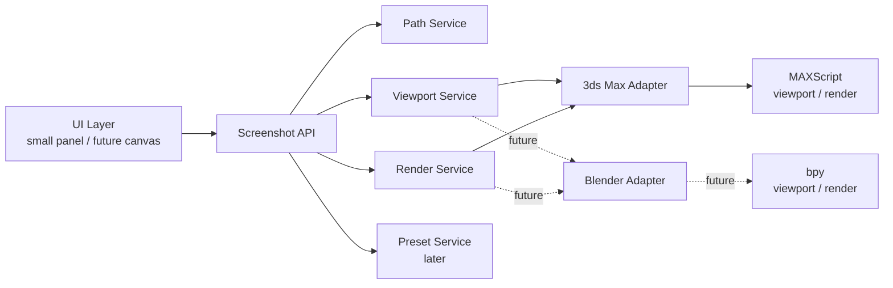
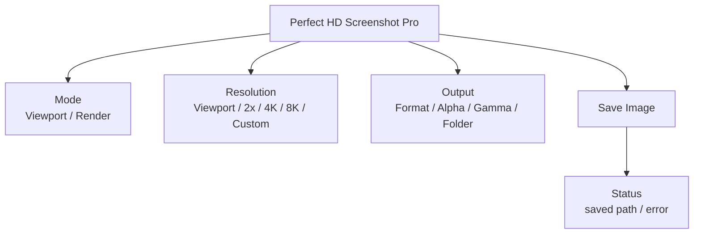
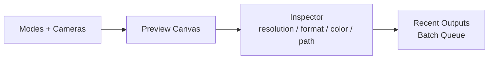

# Step-by-Step Roadmap

## 我们先走这条线

```text
先定产品形态
再定 UI
再定核心接口
再写最小可用版
再上 GitHub
再考虑 Blender
```

## 第一阶段：只做 3ds Max MVP

目标：

```text
拖入脚本 -> 打开小窗口 -> 识别视口 -> 保存截图/高清渲染
```

第一阶段不做：

- 不做复杂画布。
- 不做 Blender。
- 不做批量相机。
- 不做历史库。
- 不做复杂安装器。
- 不做大资源文件。

## 产品路线图



## 架构图



## UI 形态图

第一版小插件：



未来画布版：



## 第一阶段验收标准

做到这些就算 MVP 过关：

- 拖入 `.ms` 能打开窗口。
- 能识别当前视口尺寸。
- 能保存当前视口截图。
- 能按指定分辨率做高清 render。
- 保存路径和命名稳定。
- 重复拖入不会残留旧窗口。
- 核心函数和 UI 分离。

## 我们下一步要做什么

建议下一步只做一件事：

```text
把现有 Pro 骨架收敛成真正可运行的最小版本
```

具体就是：

1. 检查 MAXScript 模块加载是否稳定。
2. 去掉现在不需要的复杂内容。
3. 保留接口层。
4. 做一个干净小 UI。
5. 输出一个单文件拖入版。
