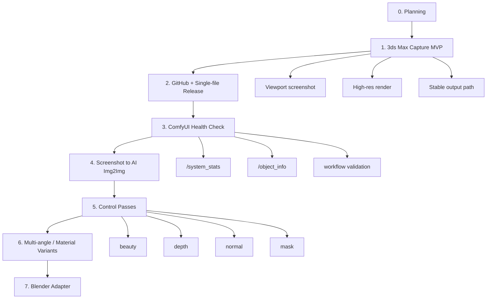
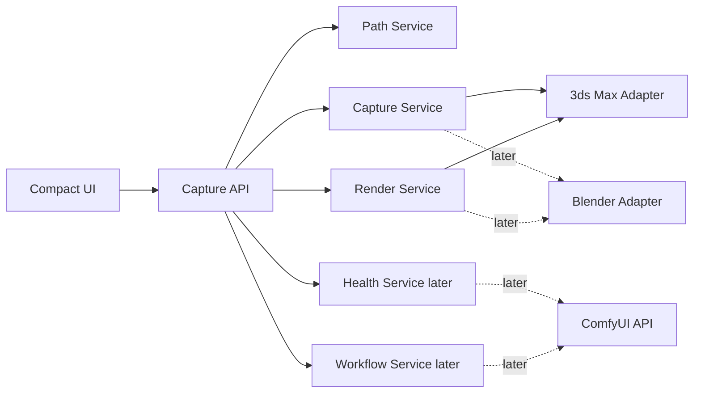
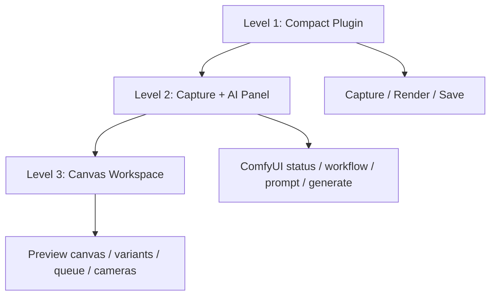

# Start Plan

## 产品一句话

```text
DCC Capture Bridge: 从 3ds Max / Blender 场景输出截图、控制图和参数，后续接入 ComfyUI 做 AI 出图、材质、多角度变体。
```

第一阶段对外仍叫：

```text
Perfect HD Screenshot Pro
```

但内部按桥接工具设计，不按一次性截图脚本设计。

## 总路线



## 技术架构



## UI 阶段



## 第一版 UI 信息结构

```text
Perfect HD Screenshot Pro

[ Capture ] [ Render ] [ AI later ]

Viewport
  Current size
  Detect

Resolution
  Viewport / 2x / 4K / 8K / Custom
  Width / Height

Output
  Format
  Folder
  Prefix
  Alpha / Gamma / VFB

Action
  Save Image
  Status
```

## MVP 只做什么

必须做：

- 拖入 `.ms` 打开窗口。
- 识别当前活动视口尺寸。
- 保存当前视口真实截图。
- 用当前渲染器输出指定分辨率。
- 输出文件名包含尺寸和时间。
- 重复拖入不会残留旧窗口。

先不做：

- ComfyUI 调用。
- AI prompt。
- 画布。
- 历史库。
- 批量相机。
- Blender。

## 为什么这样做

如果第一版直接做 AI/画布，风险是：

- UI 过早膨胀。
- ComfyUI 节点兼容问题拖慢基础功能。
- 3ds Max 和 Blender 适配混在一起。

所以第一步先做一个干净的 Capture API 和薄 UI。后续 AI、ComfyUI、Blender 都接同一个底层概念。

## 下一个可执行任务

```text
创建一个单文件 MVP:
dist/PerfectHDScreenshotPro_MVP.ms
```

它里面先包含：

- `PHDS.detectViewportSize()`
- `PHDS.captureViewport()`
- `PHDS.renderImage()`
- `PHDS.buildOutputPath()`
- 一个简单 rollout UI

后续再把单文件拆回源码结构并自动构建。

## 语言策略

默认语言：

```text
English
```

原因：

- GitHub、开发、错误定位、国际客户都以英文为主。
- 3ds Max / Blender 插件生态也更适合英文作为主语言。

同时支持：

```text
中文
```

策略：

- 核心代码和 API 命名保持英文。
- UI 文案通过本地化表切换。
- 文档可以中英双语。
- 以后如果客户需要，可继续加日语、韩语、西语。

第一版 MVP 已加入顶部语言选择：

```text
Language: English / 中文
```
