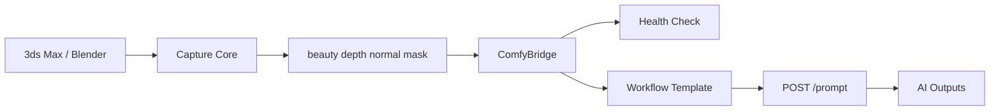

# AI Pipeline Plan

## Long-term Idea

The screenshot is the entry point, not the final product.

```text
DCC scene
-> beauty / depth / normal / mask / metadata
-> ComfyUI workflow
-> AI output
-> review / refine / material / multi-angle variants
```

## ComfyUI Integration Points

Planned API checks:

- `GET /system_stats`
- `GET /object_info`
- `POST /upload/image`
- `POST /prompt`
- `GET /history/{prompt_id}`
- `GET /view`
- WebSocket progress monitoring

## Architecture



## Important Rule

Do not rebuild ComfyUI inside 3ds Max or Blender. The DCC tool should only provide a controlled workflow interface:

- Select workflow.
- Upload capture assets.
- Set key parameters.
- Generate.
- Review output.

## Workflow Template Strategy

Workflow node IDs can change, so workflows must be versioned:

```text
workflows/img2img-basic/workflow_api.json
workflows/img2img-basic/mapping.json
workflows/img2img-basic/README.md
```

The plugin should read a mapping file instead of hard-coding node IDs throughout the code.
