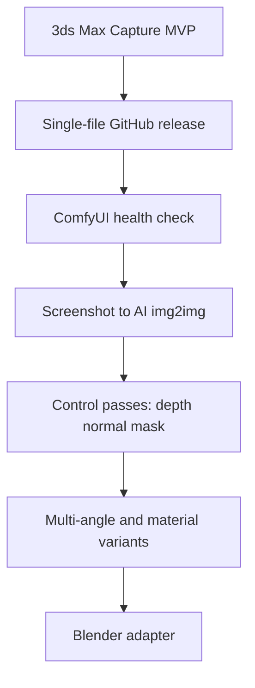

# Start Plan

## Product Direction

This project begins as a 3ds Max screenshot utility, but the long-term direction is a DCC capture bridge:

```text
3ds Max / Blender scene
-> capture assets and camera metadata
-> ComfyUI workflow
-> AI images, material concepts, and multi-angle variants
```

## Phase Roadmap



## MVP Scope

The first build only does:

- Drag-and-drop launch in 3ds Max.
- Detect active viewport size.
- Capture current viewport.
- Render active view/camera at selected resolution.
- Save files with stable names.

Not included yet:

- ComfyUI calls.
- AI prompt UI.
- Canvas workspace.
- Output history.
- Batch cameras.
- Blender add-on.

## Validation

The MVP script has only been statically checked outside 3ds Max. It still needs real 3ds Max runtime testing.
